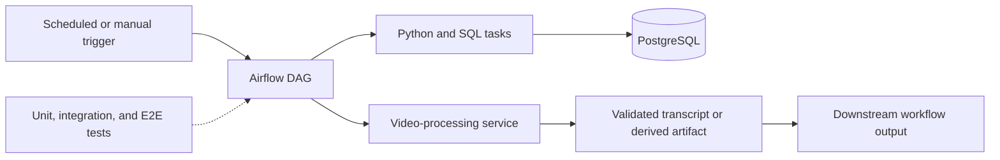

# Airflow DAGs and production-style data workflows

This repository demonstrates production-style Apache Airflow orchestration for data and media workflows. It includes Docker-based local environments, PostgreSQL-backed services, testing layers, and an AI-assisted video-processing workflow designed around explicit task boundaries and repeatable execution.

## What this portfolio project demonstrates

- **Orchestration:** composable DAGs, task dependencies, retries, scheduling, and operational boundaries.
- **Data platform foundations:** PostgreSQL integration, Python utilities, SQL-oriented workflows, and reproducible Docker environments.
- **Testing:** unit, integration, and end-to-end test areas with dedicated test Compose configuration.
- **AI-assisted processing:** workflow patterns for video processing with Whisper-style transcription services, without publishing media or model credentials.
- **Delivery discipline:** GitHub-based collaboration, configuration separation, and production/test Compose variants.

## Architecture at a glance

## Safe local setup

1. Review the Compose files and choose the local or test profile.
2. Provide any environment-specific values through your local secret mechanism; do not commit them.
3. Start the selected Docker Compose stack.
4. Run the repository's configured checks with `uv` or the project toolchain.

The exact commands and service requirements are intentionally kept in the repository configuration rather than in this portfolio summary. Inspect `docker-compose*.yml`, `pyproject.toml`, `tests/`, and `e2e/` before running a profile.

## Important boundaries

This public repository does **not** include credentials, tokens, account data, private paths, production endpoints, proprietary media, or operational secrets. Any media and environment-specific configuration must be supplied locally by an authorized operator. The examples are intended to communicate engineering patterns; deployment hardening, access control, retention, and observability must be completed for each real environment.

## Repository map

| Area | Role |
| --- | --- |
| `congress_videos/` | Video-oriented DAG and workflow code |
| `utils/` and `scripts/` | Reusable helpers and local automation |
| `tests/` | Automated validation |
| `e2e/` | End-to-end scenarios |
| `docker-compose*.yml` | Local, test, production-shaped, and Whisper service profiles |
